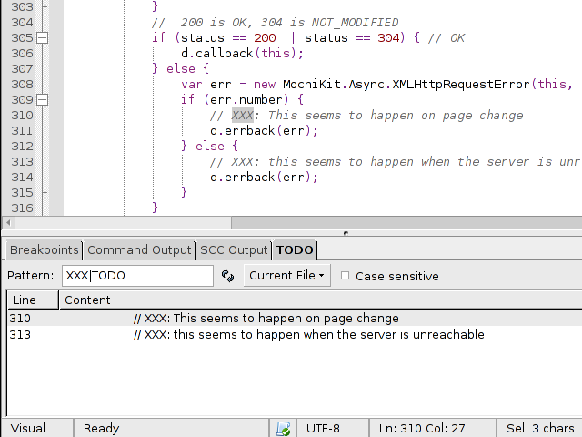

# TODO Helper

A Komodo add-on that adds a "TODO" widget into the bottom Komodo pane. This
widget will display any TODO markers found inside of your source code.

## Screenshot

## About

This extension provides features such as:
* defining custom regex TODO markers
* case sensitivity searching
* search context (current file, opened files, active project)
* double-click on a result to jump to that file position
* next, previous buttons to jump between markers
* statusbar icon shown when (and how many) todo items are found

## Installing

You can use Komodo's "Tools > Add-ons" dialog to install the add-on, since the
add-on is published on the Komodo community extension list:
http://community.activestate.com/xpi/todo-helper

## Building from source

  koext build

